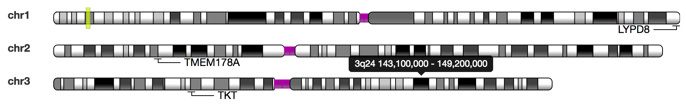

# karyotypeSVG

This project allows to draw SVG graphics showing one (or multiple) ideograms of karyotypes (cytobands) of a chromosome.

The code is derived from Thomas Down's original [karyoscape code](https://github.com/dasmoth/dalliance/blob/0.7.x/js/karyoscape.js) and interacts well with [Biodalliance](https://github.com/dasmoth/dalliance) using an event model. 

## Example

More examples are available after a checkout from 
 - [index.html](index.html) shows how to create an ideogram using require.js
 - [index1.html](index1.html) shows how to add some customizations
 - [index2.html](index2.html) shows how to show an ideogram for each human chromosome

